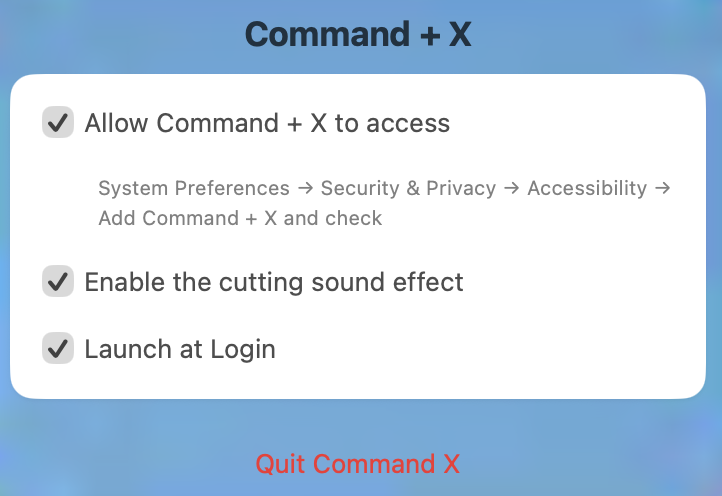

# Command X

Command X is a macOS menu bar app that allows you to cut and paste files or folders in Finder using Command+X and Command+V, with a sound effect and launch-at-login support.

## Screenshots

## Features
- Cut and paste files/folders using global Command+X and Command+V shortcuts
- Option to launch at login by default
- Plays a sound effect when Command+X is pressed
- Simple menu bar UI for settings

## Installation

**System Requirements:**  
- macOS **Big Sur (11.0)** or later  
- Apple Silicon or Intel Mac

---
> [!IMPORTANT]
> We don't have an Apple Developer account yet. The application will show a popup on first launch that the app is from an unidentified developer.
> 1. Click **OK** to close the popup.
> 2. Open **System Settings** > **Privacy & Security**.
> 3. Scroll down and click **Open Anyway** next to the warning about the app.
> 4. Confirm your choice if prompted.
>
> You only need to do this once.

### Download and Install Manually

## Usage
1. Launch the app (it runs in the menu bar)
2. Select files/folders in Finder, then press **Command+X** to cut them (reads current Finder selection via AppleScript)
3. Navigate to the destination folder in Finder, then press **Command+V** to move the files/folders there
4. Access settings via the menu bar icon: toggle sound, launch at login, etc.

## How It Works
- The app registers global hotkeys for Command+X and Command+V
- Uses Accessibility API to automate file operations
- Stores settings in UserDefaults

## Limitations
- The app cannot override Finder’s built-in shortcuts, but listens for global shortcuts and automates file operations with user permission.

## Contributing
Contributions are welcome! Please open an issue or submit a pull request.

## License
This project is licensed under the GNU General Public License v3.0 - see the [LICENSE](LICENSE) file for details. 
